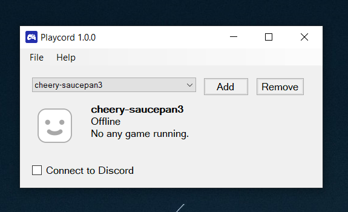

#### Playcord is now archived as Discord has added integration for linking PlayStation account. You can continue using Playcord, but note that no updates (even bug fixes) will be released.

---

# Playcord

Shows your PlayStation status as Discord Rich Presence. Inspired and based by [Tustin's PlayStationDiscord](https://github.com/Tustin/PlayStationDiscord), but in Python. Built with Toga (for GUI) and Briefcase (for packaging) and made for GNU/Linux and Windows. 

> **NOTE 1** 
> The project is still under development but most functions should work. If you get an error, please report by creating a new issue under "Issues" tab.

> **NOTE 2** 
> GNU/Linux build may not working right now due to an exception that raised on the GUI library that Playcord uses.

    

---

## Story

One of my friends told me about an app that shows your PlayStation status as Discord Rich Presence, and he said that he was using Tustin's PlayStationDiscord app, but it was not connecting to Discord properly and causing login issues in the latest version.

Then I looked in GitHub to see alternatives, however surprisingly there is almost no any app that shows your current PlayStation game as rich presence on Discord (at the time I'm writing this). So I wanted to build an alternative in a different programming language that works cross-platform and without using Electron.

Tustin's PlayStationDiscord app uses Electron, so it can open the authorization URL in a new window and can control the browser window easily. As there is no something like this in Python, I thought about embedding a web driver in the application first, so it can launch a Chromium instance and control it in code. However, it caused a lot of issues when executing the compiled binary and increased the application size a lot. So I needed alternative solutions.

When you log in using PlayStation App's login URL, it opens the PlayStation App in the device by redirecting to `com.playstation.PlayStationApp://`, this is actually made for PlayStation's Android app, but other operating systems can handle custom URIs too, for example in Windows, by modifying Registry. So it is possible to open a specific app when you go to a custom URL in your browser.

This is the best solution I found so far, so it is not needed to embed a browser instance and make the app bloated. Because of that Registry thing, the app must be installed on computer. So it is not portable. (Actually if you modify your Registry yourself then you can get it work but nobody wants to modify Registry manually.) However, I don't count this as a "disadvantage" because the app already creates and modifies files for storing your login tokens. So there is no point for making it portable.

## Credits

Playcord wouldn't be possible without [PlayStationDiscord](https://github.com/Tustin/PlayStationDiscord). Also thanks to [@Venomliz](https://github.com/venomliz) for testing and giving suggestions in development phase of the app.

## Download

You can get it from ["Releases"](https://github.com/ysfchn/Playcord/releases) tab. You can also download it from ["Actions"](https://github.com/ysfchn/Playcord/actions).

## License

Source code is licensed under GPL 3.0 license. You must include the license notice in all copies or substantial uses of the work.
